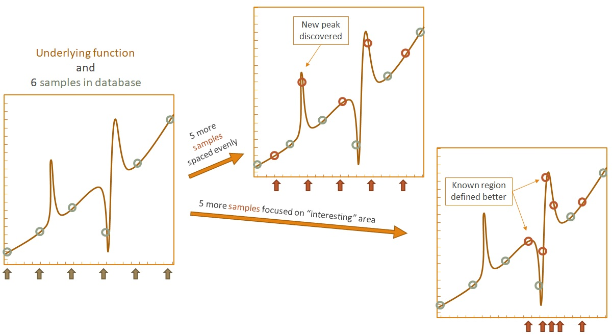
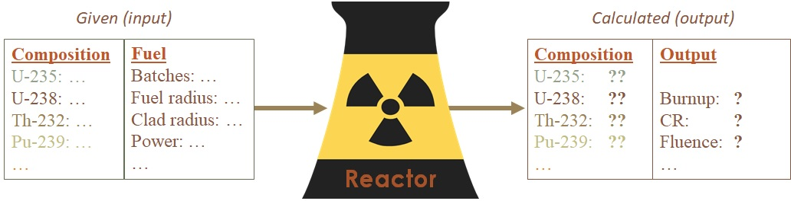
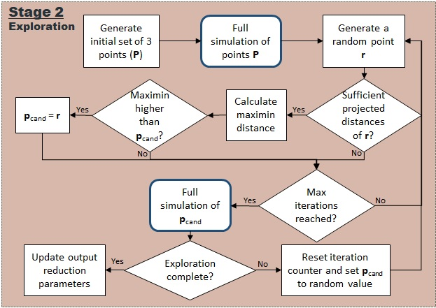
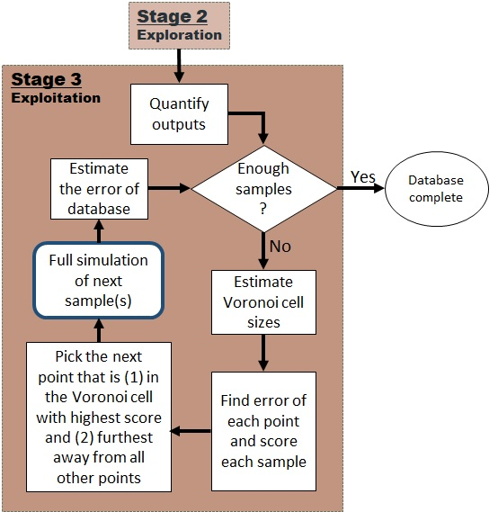
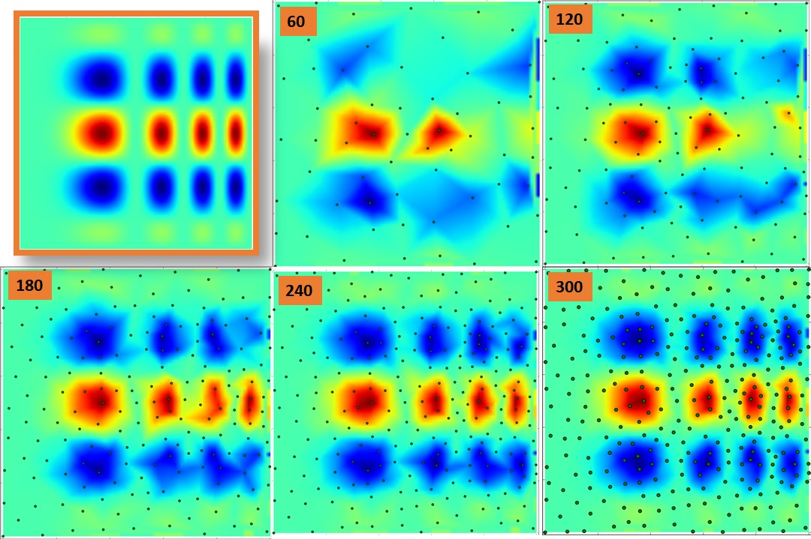
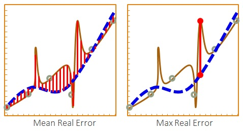
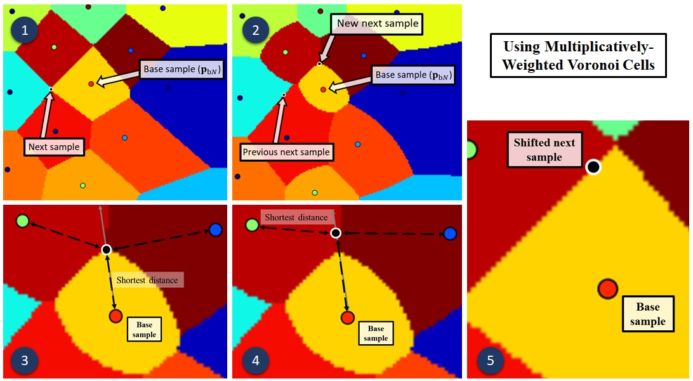
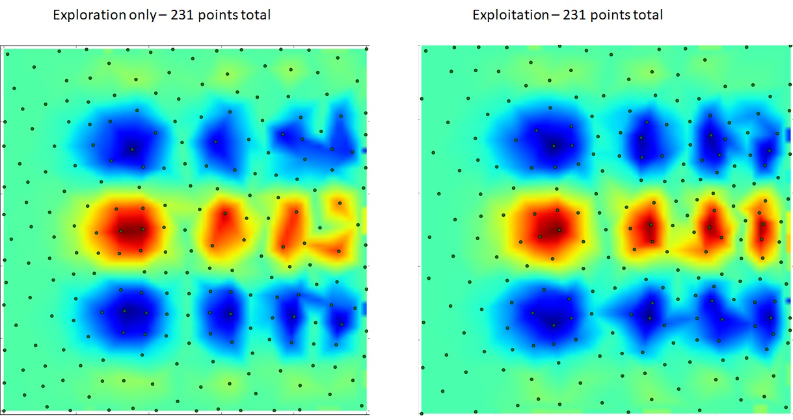
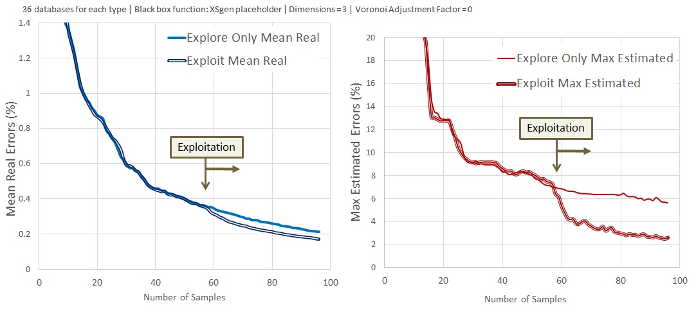
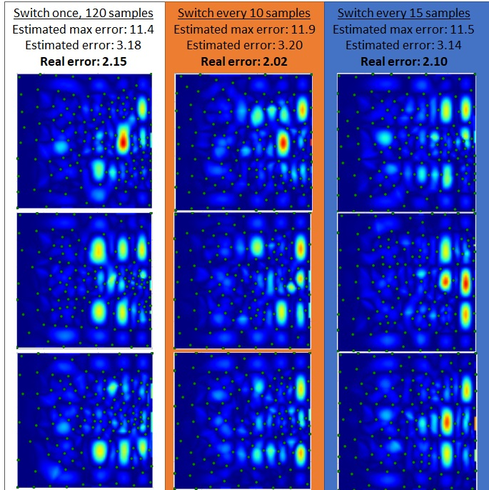

# NUDGE: NUclear Database GEneration software
This software package takes a costly black-box model and automatically creates a metamodel of it. This metamodel consists of a database of outputs from the costly model and an algorithm that uses this database to estimate outputs. The created database is also intended to be used to train an arbitrary machine learning model. NUDGE tries to select inputs to maximize the information obtained about the underlying blackbox model and hence is agnostic to the model that uses the database it creates.

The software tries to balance between ignoring the "interesting" area and only focusing on it (in arbitrary number of dimensions).

## Running NUDGE
To run nudge, run nudge.py in the nudge/ directory from terminal:

>$ python /src/nudge.py -h

(You will need numpy, scipy, and matplotlib for full functionality.)

##

 Copyright 2016 Cem Bagdatlioglu

 This program is free software; you can redistribute it and/or modify
 it under the terms of the GNU General Public License as published by
 the Free Software Foundation; either version 2 of the License, or
 (at your option) any later version.

 This program is distributed in the hope that it will be useful,
 but WITHOUT ANY WARRANTY; without even the implied warranty of
 MERCHANTABILITY or FITNESS FOR A PARTICULAR PURPOSE. See the
 GNU General Public License for more details.

## Objective
The goal is to create a database that is used to estimate outputs of the costly simulation. 

For example, a costly simulation could take two inputs, fuel radius (r) and enrichment (x). Each time inputs are entered and the simulation starts, it takes a very long time (hours up to days) for the output to be calculated. (Hence *costly* simulation.) Five cases can be generated as shown in an example database below.

Fuel radius is varied between 1 cm and 2 cm, while enrichment is varied between 3% and 5%. All four of the combinations of the extremes of these values are recorded in the database as well as the "middle" case (these *samples* are named *libraries* to keep it generic: the outputs can have many dimensions of data). Now when a previously unknown input, such as r=1.5 cm and x=4%, is required, a model that trained on this database can estimate the results. The objective of this software is to intelligently select the inputs for the data to include in the database, trying to maximize the information obtained by each additional sample.

## Workflow:

The software first screens the inputs and attempts to reduce the dimensionality of the model. Next, during the exploration step the output space is explored ignoring the outputs. Finally, during the exploitation step, all the available information is utilized to select next samples to include in the database.

### 1 Screening

  - Screening is a short step used to reduce the dimensionality of the model if possible
  - Uses the outputs of incomplete (but still useful) runs
  - Runs basecase as screening run
  - Estimates total time and adjusts accordingly
  - Uses Monte-Carlo inv-norml distance point sampling
  - Uses Multi-d domain cropping
  
### 2 Exploration

  - Runs basecase
  - Uses Monte-carlo based space-filling design
  - The sample selection methodology scales well with dimensions
  
### 3 Exploitation

  - Finds highest scored points and selects inputs near them
  - Estimates max error
  - Repeats until stop criteria met
  
### Example 2D Database Building

The figure below shows a 2D example model as it improves with increased samples. The original function is shown in the upper-left corner.

## Naming and standards:
The database folder should contain the following. The default names can be changed from the objects.py file.
* basecase.py				xsgen input file containing base-case values
* inputs.txt				file containing database inputs
* /SR_Inputs 				folder containing all screening inputs
* /FR_Inputs 				folder containing all full run inputs
* /SR_Outputs				folder for all screening output libraries
* /FR_Outputs				folder for all full library outputs

## Terms:
- Library number: indicated as [number]. Unique number for input-output pair. Starts at zero.
- Library progress: screening:[0:1), full=1
- Screening library: A library that's run in a short time and that has curtailed outputs
- Varied inputs: Names of inputs that libraries get interpolated on
- Coordinates: the normalized ([0,1]) input array with only the varied inputs, ordered alphabetically
- Voronoi cell: The hyper-dimensional "volume" made by points closest to target point

## Notes:
- Folder structure and naming chosen to be simple and intuitive. This enables users to copy-paste their existing libraries and easily allow NUDGE to use it in a given database
- xsgen inputs include void and cladding radius, NUDGE also uses thickness in inputs and some workflow
- Creation of new library: 1) Generate input file, 2) Initiate library, 3) Add library object to database
- Constant inputs will be assigned the value in basecase, which will be the 0th library in database
- Dicts in the xsgen input file (initial heavy metal) should be written so that each item is in a new line
- During the Voronoi cell volume calculation, best points to use as inputs during the next-batch are saved too

## Error Measures
There are two main categories of errors: estimated and real. Estimated errors are based on the database of outputs only, while the real error uses the underlying costly model to obtain errors. Real errors are therefore only available if the underlying model can be run with very low cost (not possible in non-testing applications). The software reports both mean and maximum errors for each category. 

While the mean error averages all the errors using the entire domain, maximum error reports the worst error in the entire domain. Each error can be useful depending on the use-case.

## Sample Shifting
This software utilizes Multiplicatively [Weighted Voronoi](https://en.wikipedia.org/wiki/Weighted_Voronoi_diagram) cells in the workflow. The estimated errors are used as weights for the voronoi cells in order to combine an error measure with a space-filling criterion during next sample selection that scales with dozens or more dimensions.

(1) A base sample with the highest combined score is selected from all samples in the database. Without the Weighted Voronoi cells, the next sample would've been selected as the point "furthest away from the base point while still being within its Voronoi cell".

(2) The new, multiplicatively weighted, Voronoi cells are drawn and the same rule for next sample selection is applied.

(3) The sample closest to the 'New next sample' is found.

(4) The 'New next sample' is moved along the line between itself and the closest sample until it is equidistant to two samples (on the boundary of a regular Voronoi cell).

(5) New shifted sample is shown. Shifting is used to ensure proper space-filling properties.

## Examples

### Exploration vs. Exploitation

The figure below visually demonstrates the effectiveness of the exploitation step. It shows two models of the original function shown above in the Example 2D Database section. The model shown on the right has the final 100 samples selected using exploitation.

This behavior can be demonstrated with a statistical study. A 3-dimensional black-box function was chosen to be modeled repeatedly and results were analyzed. On one case 36 models were built using exploration only, while the other case used exploitation for the final samples. The clear difference in the final errors can be seen below.

### Switching from Exploration to Exploitation

The merits of going back to exploration after some exploitation has been done is studied in this section. 3 cases were prepared with different switching strategies. Given that the total number of exploration and exploitation are equal, it was found that when and how often the switching happens did not substantially affect outcomes.

The figure below shows 3 example **difference plots** of each case for the comparative study. 

